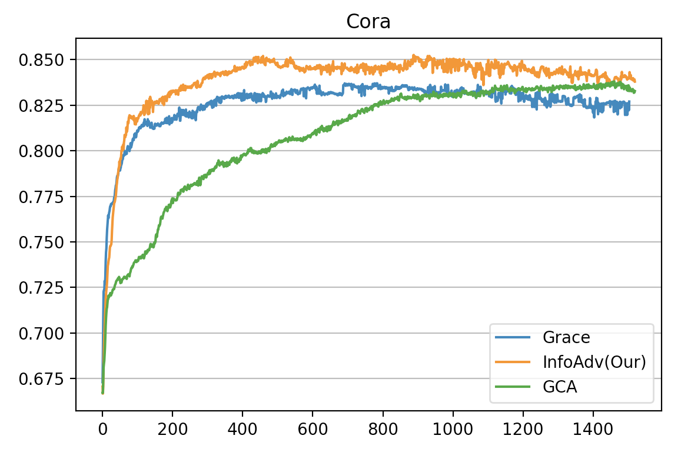

## Mentioned Paper in Rebuttal Responses.
- [1] Poole B, Ozair S, Van Den Oord A, et al. On variational bounds of mutual information[C]//International Conference on Machine Learning. PMLR, 2019: 5171-5180.
- [2] Saunshi N, Plevrakis O, Arora S, et al. A theoretical analysis of contrastive unsupervised representation learning[C]//International Conference on Machine Learning. PMLR, 2019: 5628-5637.
- [3] You Y, Chen T, Sui Y, et al. Graph contrastive learning with augmentations[J]. Advances in Neural Information Processing Systems, 2020, 33: 5812-5823.
- [4] Zhu Y, Xu Y, Yu F, et al. Graph contrastive learning with adaptive augmentation[C]//Proceedings of the Web Conference 2021. 2021: 2069-2080.

## Experiments for Early Stopping (Reviewer #6)

Figure 1: The evaluation curve during the whole training.

Table 1: The **Highest** score and its epoch during the whole training.

## Experiments for Link Prediction STD (Reviewer #2)

## Experiments for Additional Baselines BGRL (Reviewer #1)

All of our InfoAdv and its variants outperform BGRL in four datasets.

Table 3: Performance comparison for InfoAdv and BGRL
| Methods\Datasets | Cora        | Citeseer     | Pubmed      | Aphoto       |
|------------------|-------------|--------------|-------------|--------------|
| BGRL             | 82.62+-1.00 | 69.78+-0.41  | 86.35+-034  | 93.13+-0.10  |
| InfoAdv          | **84.82+-0.83** | **73.00+-0.42**  | **86.87+-0.28** | 93.54+-0.04  |
| InfoAdv(w/o Gen) | 84.40+-0.99 | 72.51+-0.48  | 86.67+-0.23 | 93.26+-0.12  |
| InfoAdv(w/o Reg) | 84.36+-0.54 | 72.74+-0.27  | 86.82+-0.25 | **93.80+-0.12**  |

## Experiments for Additional Task Node Cluster (Reviewer #1)

InfoAdv
cora 0.24546831846237183
citeseer 0.3328293263912201+-0.00026131648337468505
pubmed 0.26838254928588867+-1.431444616173394e-05
aphoto 0.5511009097099304+-0.0005574592505581677

GRACE
cora 0.2099568247795105 0.000436
citeseer 0.2682441174983978 0.0001915
pubmed 0.24091987311840057 0.0000171
aphoto 0.48744437098503113 0.000428

