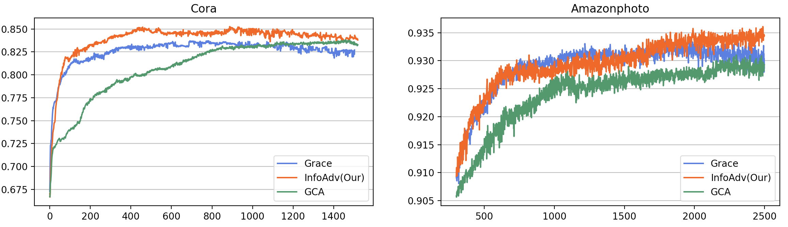
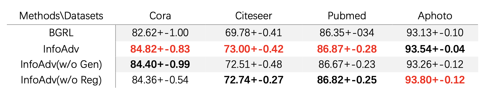

## Additional Support for Rebuttal

### 1. Experiments for Early Stopping (Reviewer #6)

Figure 1: The evaluation curve during the whole training.

Table 1: The **Highest** score and its epoch during the whole training.

---
### 2. Experiments for Link Prediction STD (Reviewer #2)

---
### 3. Experiments for Additional Baselines BGRL (Reviewer #1)

As shown in Table 3, all of our InfoAdv and its variants outperform BGRL in four datasets.

---
### 4. Experiments for Additional Task Node Cluster (Reviewer #1)

- InfoAdv
  - cora 0.24546831846237183
  - citeseer 0.3328293263912201+-0.00026131648337468505
  - pubmed 0.26838254928588867+-1.431444616173394e-05
  - aphoto 0.5511009097099304+-0.0005574592505581677

- GRACE
  - cora 0.2099568247795105 0.000436
  - citeseer 0.2682441174983978 0.0001915
  - pubmed 0.24091987311840057 0.0000171
  - aphoto 0.48744437098503113 0.000428

