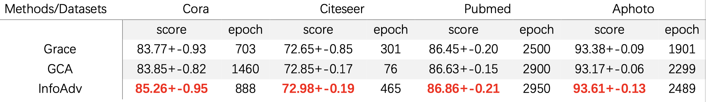
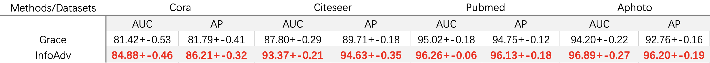
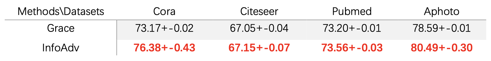

## Additional Support for Rebuttal

### 1. Experiments for Early Stopping (Reviewer #6)

As is shown in Figure 1 and Table 1, most part of the evaluation curve of SOTA baselines (GRACE ang GCA) are below us, revealing they can hardly surpass us by early stopping.

Figure 1: The evaluation curve during the whole training.

Table 1: The **Highest** score and its epoch during the whole training.

---
### 2. Experiments for Link Prediction Standard Deviation (Reviewer #2)

Table 2: The standard deviation for Link Prediction.

---
### 3. Experiments for Additional Baselines BGRL (Reviewer #1)

As is shown in Table 3, all of our InfoAdv and its variants outperform BGRL in four datasets. 

Table 3: Performance comparison between InfoAdvs and BGRL on node classification in terms of F1-micro score.

---
### 4. Experiments for Additional Task Node Clustering (Reviewer #1)

As is shown in Table 4, our InfoAdv outperforms SOTA baseline GRACE in node clustering, revealing the capability of our method on new task of node clustering.

Table 4: Performance comparison between InfoAdv and SOTA baseline GRACE on node clustering in terms of cluster purity.

